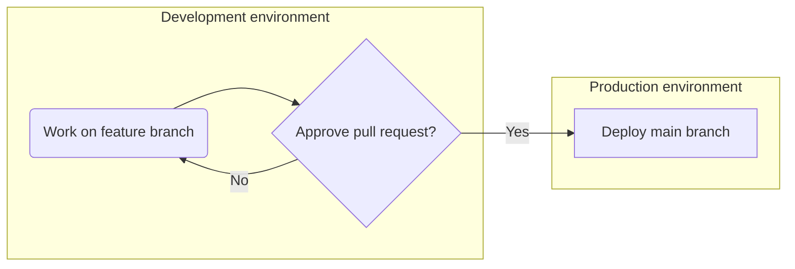
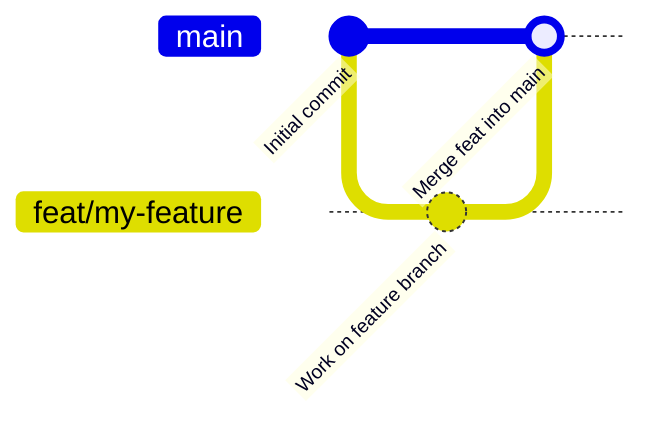

# Contribution guide

We welcome contributions to SORT! This document outlines the guidelines for contributing to the project.

# Getting Started

## Organising work

Please use the [Kanban board](https://github.com/orgs/RSE-Sheffield/projects/19) to assign tasks.

# Making changes

## Proposing changes

1. [Raise an issue](https://github.com/RSE-Sheffield/SORT/issues/new?template=Blank+issue) clearly describing the
   problem or user requirements;
2. [Create a branch](https://docs.github.com/en/issues/tracking-your-work-with-issues/using-issues/creating-a-branch-for-an-issue)
   that is associated with that issue. It can be helpful to prefix the branch name to match the type of changes
   e.g. `feat/123-my-feature` for features or `docs/my-guide` for documentation, etc.
   See [Semantic branch names](https://damiandabrowski.medium.com/semantic-branch-names-and-commit-messages-3ac38a6fcbb6).
3. In that branch, make changes that aim to resolve that issue;
4. Create
   a [draft pull request](https://docs.github.com/en/pull-requests/collaborating-with-pull-requests/proposing-changes-to-your-work-with-pull-requests/about-pull-requests#draft-pull-requests) (
   PR) while the changes are being designed;
5. When ready, mark the PR "Ready for review" and request for reviewers to look at the proposed changes;

## Environments

There are two main environments:

- Development (any non-`main` branch on the `sort-web-dev` virtual machine)
- Production (the `main` branch and the `sort-web-app` virtual machine)

### Local development environment

```bash
python -m venv .venv
source .venv/bin/activate
python.exe -m pip install --upgrade pip
pip install --editable .
pip install -r requirements.txt -r requirements-dev.txt
```

When you check out a new development branch, it's a good idea to ensure your environment is up-to-date by running the commands below:

```bash
pip install -e .[dev]
pip install -r requirements.txt -r requirements-dev.txt
python manage.py migrate
npm install
```

This will ensure that the dependencies installed in your development environment match those in the production environment.

## Change process

Any proposed changes should be proposed in pull requests that would be merged into the `main` branch.



so the commit history would look something like this:



# Code of Conduct

We expect all contributors to follow the SORT [Code of Conduct](CODE_OF_CONDUCT.md).

# Testing

Please read the [testing documentation](docs/testing.md).

# Documentation

Developer documentation is available in the [docs/](docs/) directory. See [docs/README.md](docs/README.md) for a guide to navigating the documentation.
