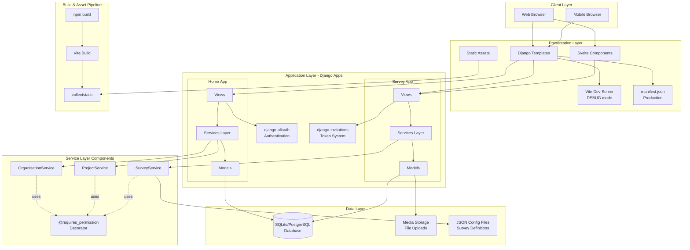
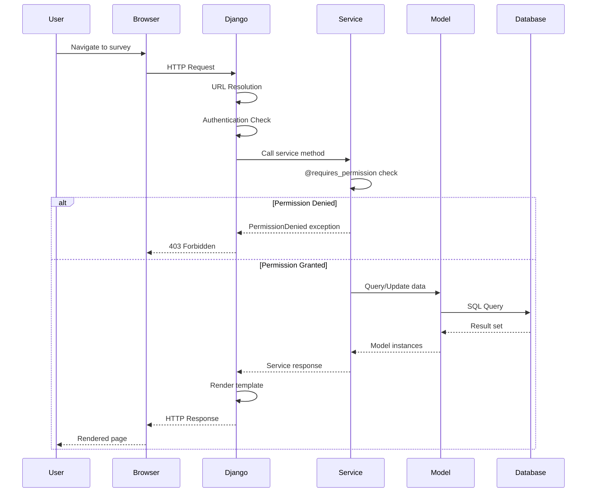
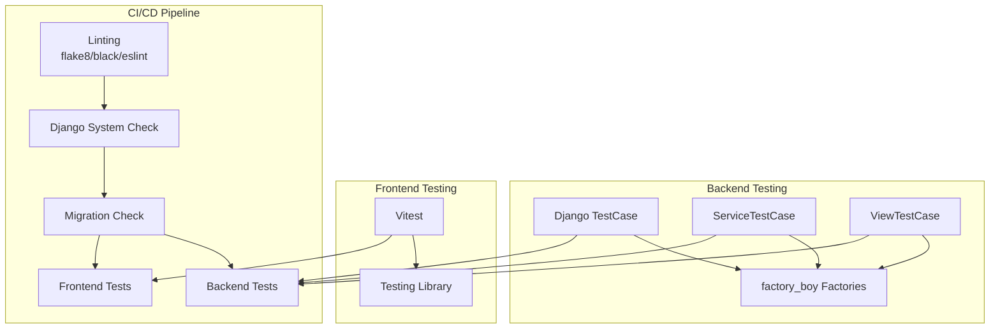

# SORT Architecture

## Overview

SORT (Self-Assessment of Organisational Readiness Tool) is a Django-based web application with a modern JavaScript frontend. The architecture follows a clean separation of concerns with distinct layers for presentation, business logic, and data access.

### Key Architectural Principles

1. **Service Layer Pattern**: All business logic is encapsulated in service classes with built-in permission checking
2. **Multi-Tenancy**: Organization-based isolation with role-based access control
3. **Configuration-Driven Surveys**: Survey structure defined in JSON configuration files
4. **Hybrid Rendering**: Server-side Django templates with embedded Svelte components for interactive features
5. **RESTful Design**: Clear URL hierarchy following resource relationships

## System Architecture



## Data Model Architecture

```mermaid
erDiagram
    User ||--o{ OrganisationMembership : has
    Organisation ||--o{ OrganisationMembership : contains
    Organisation ||--o{ Project : owns
    Project ||--o{ Survey : contains
    Survey ||--o{ SurveyResponse : collects
    Survey ||--o{ Invitation : generates
    Survey ||--o{ SurveyEvidenceSection : has
    Survey ||--o{ SurveyImprovementPlanSection : has
    SurveyEvidenceSection ||--o{ SurveyEvidenceFile : contains

    User {
        int id PK
        string email UK
        string first_name
        string last_name
        boolean is_staff
    }

    OrganisationMembership {
        int id PK
        int user_id FK
        int organisation_id FK
        string role "ADMIN/PROJECT_MANAGER"
        datetime created_at
    }

    Organisation {
        int id PK
        string name
        datetime created_at
    }

    Project {
        int id PK
        int organisation_id FK
        string name
        text description
        datetime created_at
    }

    Survey {
        int id PK
        int project_id FK
        string name
        json survey_config
        string status
        datetime created_at
    }

    SurveyResponse {
        int id PK
        int survey_id FK
        json answers
        boolean completed
        datetime created_at
    }

    Invitation {
        int id PK
        int survey_id FK
        string token UK
        string email
        boolean accepted
        datetime created_at
    }

    SurveyEvidenceSection {
        int id PK
        int survey_id FK
        string section_id IDX
        text notes
    }

    SurveyEvidenceFile {
        int id PK
        int evidence_section_id FK
        file file
        string filename
    }
```

## Request Flow Architecture



## Permission Architecture

```mermaid
graph TD
    Request[HTTP Request] --> Auth{Authenticated?}
    Auth -->|No| Login[Redirect to Login]
    Auth -->|Yes| Service[Service Method Call]

    Service --> Decorator[@requires_permission]
    Decorator --> Check{Permission Check}

    Check --> OrgMember{Organisation<br/>Member?}
    OrgMember -->|No| Deny403[403 Forbidden]
    OrgMember -->|Yes| Role{User Role?}

    Role -->|ADMIN| AllowAdmin[Full Access]
    Role -->|PROJECT_MANAGER| ProjectCheck{Assigned to<br/>Project?}

    ProjectCheck -->|No| Deny403
    ProjectCheck -->|Yes| AllowPM[Project Access]

    AllowAdmin --> Execute[Execute Service Method]
    AllowPM --> Execute

    Execute --> Response[Return Response]
```

## Frontend Architecture

```mermaid
graph TB
    subgraph "Django Templates"
        Base[base.html]
        Survey[survey_*.html]
        Response[survey_response.html]

        Base --> Survey
        Base --> Response
    end

    subgraph "Vite Integration"
        ViteTag[]
        ViteClient[]

        Survey --> ViteTag
        Response --> ViteTag
        Base --> ViteClient
    end

    subgraph "Svelte Components"
        ConfigApp[SurveyConfigConsentDemographyApp]
        ResponseApp[SurveyResponseApp]
        FileBrowser[FileBrowser]

        ViteTag --> ConfigApp
        ViteTag --> ResponseApp
        ViteTag --> FileBrowser
    end

    subgraph "UI Libraries"
        Bootstrap[Bootstrap 5]
        ChartJS[Chart.js]

        ConfigApp --> Bootstrap
        ResponseApp --> Bootstrap
        ResponseApp --> ChartJS
    end

    subgraph "Build Output"
        Manifest[manifest.json]
        Bundles[JS/CSS Bundles]

        ConfigApp -.builds to.-> Bundles
        ResponseApp -.builds to.-> Bundles
        Bundles -.registers in.-> Manifest
    end
```

## Deployment Architecture

```mermaid
graph LR
    subgraph "Development"
        DevServer[Django runserver<br/>:8000]
        ViteDev[Vite dev server<br/>:5173]
        DevDB[(SQLite)]

        DevServer --> DevDB
        DevServer -.HMR.-> ViteDev
    end

    subgraph "Build Process"
        NPM[npm run build]
        Collect[collectstatic]
        Migrate[migrate]

        NPM --> Collect
    end

    subgraph "Production"
        WebServer[Gunicorn/uWSGI]
        ReverseProxy[Nginx]
        ProdDB[(PostgreSQL)]
        StaticFiles[Static Files]
        MediaFiles[Media Storage]

        ReverseProxy --> WebServer
        ReverseProxy --> StaticFiles
        ReverseProxy --> MediaFiles
        WebServer --> ProdDB
    end

    Build Process --> Production
```

## Testing Architecture



## Technology Stack

### Backend
- **Framework**: Django 5.1
- **Language**: Python 3.12
- **Database**: SQLite (development), PostgreSQL (production)
- **Authentication**: django-allauth
- **Key Libraries**: django-invitations, django-crispy-forms, qr-code

### Frontend
- **Framework**: Svelte 5
- **Language**: TypeScript
- **Build Tool**: Vite 6
- **Styling**: Bootstrap 5
- **Charts**: Chart.js

### Testing
- **Backend**: Django TestCase, factory_boy
- **Frontend**: Vitest, Testing Library

### Deployment
- **WSGI Server**: Gunicorn/uWSGI
- **Reverse Proxy**: Nginx
- **Process Manager**: systemd

## Key Design Patterns

### 1. Service Layer Pattern
All business logic lives in service classes that:
- Enforce permissions via `@requires_permission` decorator
- Provide singleton instances (e.g., `organisation_service`)
- Abstract model manipulation from views
- Handle complex operations (exports, invitations, evidence management)

### 2. Configuration-Driven Design
Survey structure is defined in JSON files:
- Stored in `data/readiness_descriptions/`
- Loaded into `Survey.survey_config` JSONField
- Enables dynamic form generation without code changes
- Supports version control of assessment criteria

### 3. Role-Based Access Control (RBAC)
Permissions cascade through relationships:
- Organisation membership determines base access
- ADMIN role grants full organisation access
- PROJECT_MANAGER role grants specific project access
- Service layer enforces checks automatically

### 4. Hybrid Rendering
Combines server-side and client-side rendering:
- Django templates for page structure and static content
- Svelte components for interactive features (forms, uploads, charts)
- Vite integration switches between dev server (HMR) and built assets

## Future Architecture Considerations

### Scalability
- **Database**: Migrate to PostgreSQL for production workloads
- **Caching**: Implement Redis for session storage and query caching
- **Media Storage**: Consider S3/Azure Blob for file uploads
- **Background Jobs**: Add Celery for async tasks (exports, email sending)

### API Development
- Consider Django REST Framework for mobile app support
- Implement token-based authentication for API access
- Version API endpoints for backward compatibility

### Monitoring & Observability
- Add application performance monitoring (APM)
- Implement structured logging with correlation IDs
- Set up health check endpoints for deployment automation
- Track user analytics for survey completion rates

### Security Enhancements
- Implement Content Security Policy (CSP)
- Add rate limiting for public endpoints
- Enable two-factor authentication (2FA) for admin users
- Regular dependency vulnerability scanning
