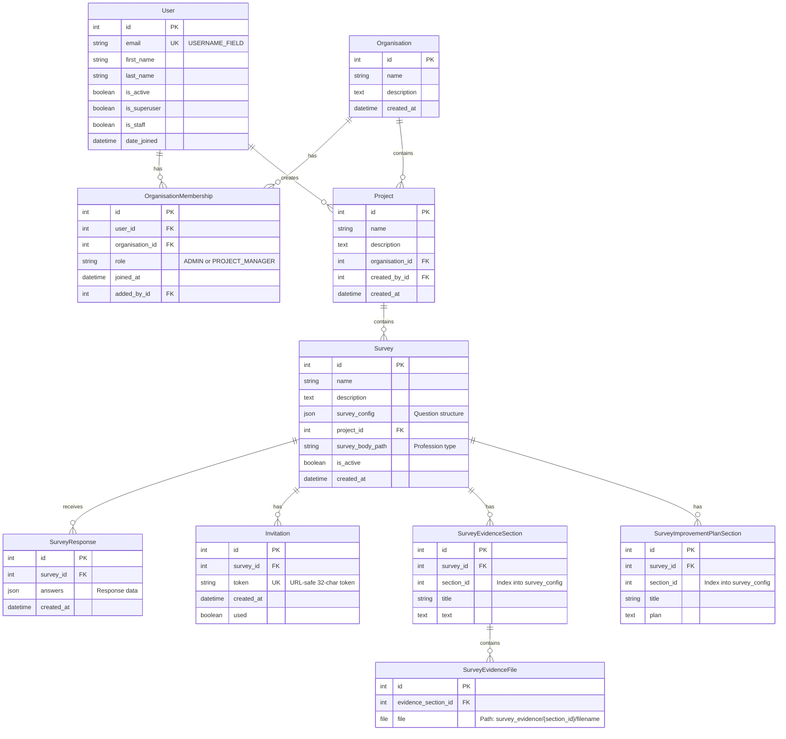

# SORT Data Model

This document describes the database schema and relationships for the SORT (Self-Assessment of Organisational Readiness Tool) application.

## Entity Relationship Diagram



## Model Descriptions

### User (home/models.py)

Custom authentication model extending `AbstractBaseUser` and `PermissionsMixin`. Uses email as the username field instead of a traditional username.

**Key Features:**

- Email-based authentication
- Staff and superuser flags for Django admin access
- Many-to-many relationship with Organisation through OrganisationMembership

**Related Manager Methods:**
- `projects_iter()`: Iterate over all projects accessible to this user

### Organisation (home/models.py)

Represents an organisational entity (e.g., NHS Trust, healthcare facility) that contains multiple projects.

**Key Features:**
- Many-to-many relationship with User through OrganisationMembership
- One-to-many relationship with Project
- Role-based access control via membership roles

**Methods:**
- `get_user_role(user)`: Returns the user's role within this organisation

### OrganisationMembership (home/models.py)

Through table for the many-to-many relationship between User and Organisation. Implements role-based access control.

**Roles:**
- `ADMIN`: Full control over organisation, all projects, and all surveys
- `PROJECT_MANAGER`: Can manage specific projects and their surveys

**Constraints:**
- Unique together: (user, organisation)

### Project (home/models.py)

Organisational unit for grouping related surveys within an organisation.

**Key Features:**
- Belongs to one Organisation
- Created by a User
- Contains multiple Surveys

**Properties:**
- `is_active`: Returns True if any survey in the project is active
- `surveys`: Returns all surveys in this project

### Survey (survey/models.py)

Core model representing a SORT assessment questionnaire.

**Key Features:**
- Configuration-driven: Question structure stored in `survey_config` JSONField
- Profession-specific: `survey_body_path` determines which profession's questions are used
- Active/inactive toggle: Controls whether responses can be submitted
- Reference number: Auto-generated identifier (e.g., "SURVEY-000001")

**Configuration Structure:**
The `survey_config` JSONField contains:
- Consent section (first section)
- SORT readiness questions (middle sections, loaded from JSON files)
- Demographics section (final section)

**Properties:**
- `reference_number`: Formatted identifier
- `sections`: Tuple of question section groups
- `fields`: All question field names
- `responses_count`: Number of submitted responses
- `has_responses`: Boolean indicating if any responses exist

**Methods:**
- `initialise()`: Set up a new survey with default configuration
- `accept_response(answers)`: Create a new SurveyResponse
- `to_csv()`: Export responses to CSV format
- `to_excel()`: Export responses to Excel format

**Related Models:**
- SurveyResponse: Response submissions
- Invitation: Token-based access links
- SurveyFile: General file attachments
- SurveyEvidenceSection: Evidence documentation per section
- SurveyImprovementPlanSection: Improvement plans per section

### SurveyResponse (survey/models.py)

Represents a single completed questionnaire submission from a participant.

**Key Features:**
- Stores answers in JSONField as nested list structure
- Immutable once created (no edit functionality)
- Validation prevents responses to inactive surveys

**Structure:**
The `answers` JSONField contains a list of sections, each containing a list of field values:
```python
[
    ["consent_value", "other_field"],  # Section 0 (consent)
    ["answer1", ["likert1", "likert2"], "answer3"],  # Section 1 (questions)
    # ... more sections
]
```

**Properties:**
- `answers_values`: Flattened generator of all answer values (expands nested Likert structures)

### Invitation (survey/models.py)

Token-based invitation system for sharing survey links publicly without authentication.

**Key Features:**
- 32-character URL-safe token (auto-generated on save)
- One-time use tracking via `used` flag
- Unique token constraint

**Methods:**
- `recipient_list(text)`: Parse comma/semicolon-separated email addresses

### SurveyFile (survey/models.py)

General file attachments associated with a survey.

**Upload Path:** `MEDIA_ROOT/survey/{survey_id}/{filename}`

### SurveyEvidenceSection (survey/models.py)

Evidence documentation for a specific section of a survey. Each evidence section corresponds to a section in `survey_config`.

**Key Features:**
- `section_id`: Index into `survey.survey_config["sections"]`
- Indexed for efficient lookups
- Unique constraint: (survey, section_id)

**Related:**
- SurveyEvidenceFile: File attachments for this evidence section

### SurveyEvidenceFile (survey/models.py)

File attachments for evidence sections (e.g., supporting documents, policies, screenshots).

**Upload Path:** `MEDIA_ROOT/survey_evidence/{evidence_section_id}/{filename}`

### SurveyImprovementPlanSection (survey/models.py)

Improvement plan documentation for a specific section of a survey.

**Key Features:**
- `section_id`: Index into `survey.survey_config["sections"]`
- DB-indexed for efficient queries
- Stores improvement plan text

## Relationships Summary

### Hierarchical Structure

```
User ← (creates) → Project
  ↓ (membership)
Organisation → Project → Survey
```

### Survey Components

```
Survey
  ├── SurveyResponse (many)
  ├── Invitation (many)
  ├── SurveyFile (many)
  ├── SurveyEvidenceSection (many)
  │     └── SurveyEvidenceFile (many)
  └── SurveyImprovementPlanSection (many)
```

### Access Control Flow

1. User joins Organisation via OrganisationMembership (role: ADMIN or PROJECT_MANAGER)
2. Organisation contains Projects
3. Projects contain Surveys
4. Permissions cascade: organisation role → project access → survey access

## Key Constraints

- **Unique Together:**
  - OrganisationMembership: (user, organisation)
  - SurveyEvidenceSection: (survey, section_id)

- **Unique Fields:**
  - User.email
  - Invitation.token

- **Indexed Fields:**
  - SurveyEvidenceSection.section_id
  - SurveyImprovementPlanSection.section_id

## JSONField Structures

### Survey.survey_config

```json
{
  "sections": [
    {
      "section": "Consent",
      "fields": [
        {
          "label": "Field label",
          "type": "radio|select|checkbox|likert|text|textarea",
          "options": ["Option 1", "Option 2"],
          "sublabels": ["Sub 1", "Sub 2"],
          "required": true
        }
      ]
    }
  ]
}
```

### SurveyResponse.answers

```json
[
  ["consent_answer", "other_field_answer"],
  ["answer1", ["likert_sub1", "likert_sub2"], "answer3"],
  ["demographics_answer1", "demographics_answer2"]
]
```

## File Upload Paths

| Model | Upload Path Pattern | Example |
|-------|-------------------|---------|
| SurveyFile | `survey/{survey_id}/{filename}` | `survey/42/document.pdf` |
| SurveyEvidenceFile | `survey_evidence/{evidence_section_id}/{filename}` | `survey_evidence/123/policy.docx` |

## Database Indexes

- `SurveyEvidenceSection.section_id`: Composite index
- `SurveyImprovementPlanSection.section_id`: DB index (`db_index=True`)

## Notes

- All timestamps use `auto_now_add=True` for creation tracking
- Soft deletes are not implemented; CASCADE deletes are used throughout
- Survey configuration is JSON-driven and loaded from files in `data/readiness_descriptions/`
- Test users have predictable emails: `user0@sort.com`, `user1@sort.com`, etc.
