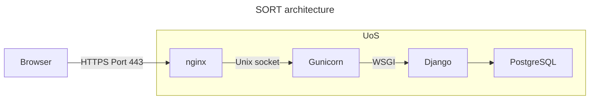

# Deployment

The production web server has the following architecture

This app can be deployed to a web server using the script [`deploy.sh`](deploy.sh).

Please read the following guides:

* Django documentation: [How to deploy Django](https://docs.djangoproject.com/en/5.1/howto/deployment/)
* [Deploying Gunicorn](https://docs.gunicorn.org/en/latest/deploy.html)

The relevant files are:

* [`pyproject.toml`](pyproject.toml) defines the [Python package](https://packaging.python.org/en/latest/)
* `MANIFEST.in` lists the files that will be included in that package
* `requirements.txt` lists the dependencies for the package

