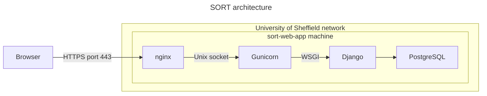

# Deployment

This app can be deployed to a web server using the script [`deploy.sh`](../deploy.sh) and configured as described in the section below.

The production web server has the following architecture:



When accessing the web site, the following process happens:

1. A user uses their web browser to access the server using the HTTPS port 443;
2. The request is sent to the web server and is handled by Nginx;
3. 

You may also refer to the following guides:

* Django documentation: [How to deploy Django](https://docs.djangoproject.com/en/5.1/howto/deployment/)
* [Deploying Gunicorn](https://docs.gunicorn.org/en/latest/deploy.html)

The relevant files are:

* The `config/` directory contains server configuration files.

# Configuration

To configure the environment variables for the service:

```bash
sudo systemctl edit gunicorn.service
```

Add the following lines:

```ini
[Service]
Environment="DJANGO_SECRET_KEY=*********"
Environment="DJANGO_ALLOWED_HOSTS=sort-web-app.shef.ac.uk www.sort-web-app.shef.ac.uk"
```

# Monitoring

## View service status

```bash
sudo systemctl status gunicorn
sudo systemctl status nginx
```

# View logs

View [nginx logs](https://docs.nginx.com/nginx/admin-guide/monitoring/logging/)

```bash
sudo tail --follow /var/log/nginx/access.log
sudo tail --follow /var/log/nginx/error.log
```

View [Gunicorn logs](https://docs.gunicorn.org/en/stable/settings.html#logging)

```bash
 sudo journalctl -u gunicorn.service --follow
```

# Control

The services are controlled using [`systemd`](https://systemd.io/), which is the service management system on Ubuntu 24. To launch services:

```bash
sudo systemctl start gunicorn
sudo systemctl start nginx
```

To stop services:

```bash
sudo systemctl stop gunicorn
sudo systemctl stop nginx
```

