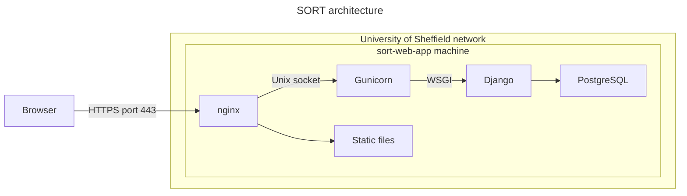

# Deployment

The production web server has the following architecture:



When accessing the web site, the following process happens:

1. A user uses their web browser to access the server using the HTTPS port 443;
2. The request is sent to the web server and is handled by Nginx;
3. Nginx uses the web server gateway interface (WSGI) to access the Django application;
4. Django uses the PostgreSQL database to store data.

You may also refer to the following guides:

* Django documentation: [How to deploy Django](https://docs.djangoproject.com/en/5.1/howto/deployment/)
* [Deploying Gunicorn](https://docs.gunicorn.org/en/latest/deploy.html)

The relevant files are:

* The `config/` directory contains server configuration files.

# Deployment process

This app can be deployed to a web server using the script [`deploy.sh`](../deploy.sh) and configured as described in the section below.

1. Configure the `.env` file as described below.
2. Run the deployment script: `sudo bash -x deploy.sh`
3. Configure the database

# Configuration

To configure the environment variables for the service, you can either edit the `.env` file and/or add them to the systemd service.

To edit the environment file:

```bash
sudo mkdir --parents /opt/sort
sudo nano /opt/sort/.env
```

This file would typically look similar to this:

```ini
DJANGO_SECRET_KEY=********
DJANGO_ALLOWED_HOSTS=sort-web-app.shef.ac.uk
DJANGO_STATIC_ROOT=/var/www/sort/static
```

# Database installation

To run these commands, switch to the `postgres` user:

```bash
sudo su - postgres
```

## Create a database

[Create a database](https://www.postgresql.org/docs/16/tutorial-createdb.html)

```bash
createdb sort
```

## Create a user

The app needs credentials to access the database.

Create a user:

```bash
createuser sort
```

# Management

To use the Django management tool

```bash
sort_dir="/opt/sort"
venv_dir="$sort_dir/venv"
python="$venv_dir/bin/python"
cd "$sort_dir"
$python "$sort_dir"/manage.py help
```

Migrate the database

```bash
sudo $python manage.py migrate
```

Create a super-user

```bash
sudo $python manage.py createsuperuser
```


# Monitoring

## View service status

```bash
sudo systemctl status gunicorn
sudo systemctl status nginx
sudo systemctl status postgresql
```

# View logs

View [nginx logs](https://docs.nginx.com/nginx/admin-guide/monitoring/logging/)

```bash
sudo tail --follow /var/log/nginx/access.log
sudo tail --follow /var/log/nginx/error.log
```

View [Gunicorn logs](https://docs.gunicorn.org/en/stable/settings.html#logging)

```bash
 sudo journalctl -u gunicorn.service --follow
```

# Control

The services are controlled using [`systemd`](https://systemd.io/), which is the service management system on Ubuntu 24. To launch services:

```bash
sudo systemctl start gunicorn
sudo systemctl start nginx
```

To stop services:

```bash
sudo systemctl stop gunicorn
sudo systemctl stop nginx
```

