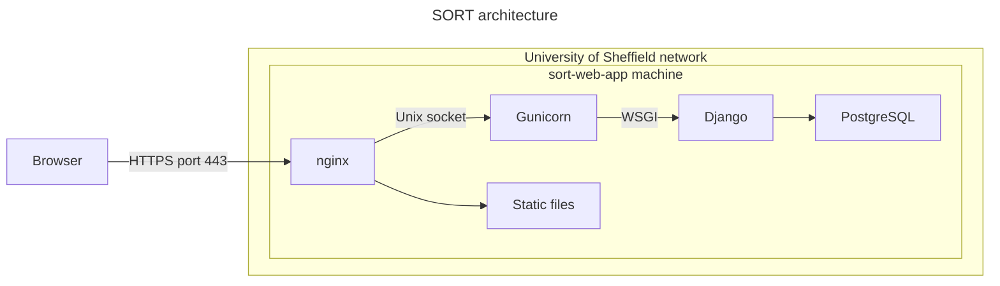

# Deployment

The production web server has the following architecture, which is a commonly-used and reasonably secure production setup for Django.



When accessing the web site, the following process happens:

1. A user uses their web browser to access the server using the HTTPS port 443;
2. The request is sent to the web server and is handled by Nginx, which acts as a ["reverse proxy" server](https://serverfault.com/a/331263);
3. Nginx uses the web server gateway interface (WSGI) to access Gunicorn, which serves the Django application;
4. Gunicorn spawns several workers to run the Python code that operates the website;
5. Django uses the PostgreSQL database to store data.

You may also refer to the following guides:

* Django documentation: [How to deploy Django](https://docs.djangoproject.com/en/5.1/howto/deployment/)
* [Deploying Gunicorn](https://docs.gunicorn.org/en/latest/deploy.html) using nginx

The relevant files are:

* The `config/` directory contains server configuration files.

# Deployment process

This app can be deployed to a web server using the script [`deploy.sh`](../deploy.sh) and configured as described in the section below.

1. Configure the `.env` file as described below.
2. Run the deployment script: `sudo bash -x deploy.sh`
3. Configure the database

We can run commands and Bash scripts as the superuser (`root`) using the [`sudo` command](https://manpages.ubuntu.com/manpages/noble/en/man8/sudo.8.html).

# Configuration

## Environment variables

To configure the environment variables for the service, you can either edit the `.env` file and/or add them to the systemd service using `systemctl edit`.

To edit the environment file:

```bash
sudo mkdir --parents /opt/sort
sudo nano /opt/sort/.env
```

This file would typically look similar to the example below. The contents of these values should be stored in a password manager. In general, the name of each environment variable is the same as the [Django setting](https://docs.djangoproject.com/en/5.1/ref/settings) with the prefix `DJANGO_`.

```ini
DJANGO_SECRET_KEY=********
DJANGO_ALLOWED_HOSTS=sort-web-app.shef.ac.uk
DJANGO_STATIC_ROOT=/var/www/sort/static
WSGI_APPLICATION=SORT.wsgi.application
DJANGO_SETTINGS_MODULE=SORT.settings
# Database settings
DJANGO_DATABASE_ENGINE=django.db.backends.postgresql
DJANGO_DATABASE_NAME=sort
DJANGO_DATABASE_USER=sort
DJANGO_DATABASE_PASSWORD=********
DJANGO_DATABASE_HOST=127.0.0.1
DJANGO_DATABASE_PORT=5432
```

You can generate a secret key using the Python [secrets library](https://docs.python.org/3/library/secrets.html):

```bash
python -c "import secrets; print(secrets.token_urlsafe(37))"
```

## Service settings

If needed, you can add environment variables to the `systemd` service like so:

```bash
sudo systemctl edit gunicorn.service
```

And add environment variables, or other `systemd` settings, to that override configuration file:

```
[Service]
Environment="DJANGO_SECRET_KEY=********"
Environment="DEBUG=off"
```


# Database installation

The database may be administered using command-line tools and SQL statements that are run as the `postgres` user. For more details, please refer to the [PostgreSQL documentation](https://www.postgresql.org/docs/16/index.html) and [this guide](https://dev.to/matthewhegarty/postgresql-better-security-for-django-applications-3c7m).

To run these commands, switch to the `postgres` user:

```bash
sudo su - postgres
```

The [`su` command](https://manpages.ubuntu.com/manpages/noble/man1/su.1.html) creates a new shell on behalf of the `postgres` user.

## Create a database

[Create a database](https://www.postgresql.org/docs/16/tutorial-createdb.html) with the appropriate [encoding](https://www.postgresql.org/docs/current/multibyte.html).

```bash
createdb --template=template0 --encoding=UTF8 --locale=en_GB.UTF-8 sort "SORT application"
```

We can list databases using `psql --list`.

## Create a user

The SORT app needs credentials to access the database. We'll create a database user that the application will use to read and write data.

Create a user:

```bash
createuser sort
```

Set the password for that user using the [psql tool](https://manpages.ubuntu.com/manpages/noble/man1/psql.1.html) which lets us run SQL queries on the PostgreSQL server.

```bash
psql sort
```

```sql
ALTER USER sort WITH PASSWORD '********';
```

We can list users (i.e. database "roles") using [the `\du`  command](https://www.postgresql.org/docs/current/app-psql.html#APP-PSQL-META-COMMAND-DU) in PostgreSQL.

```bash
psql sort --command "\du"
```


## Grant permissions

We must allow this user the minimum necessary privileges to operate the web app. We authorise the user using the PostgreSQL [grant statement](https://www.postgresql.org/docs/current/sql-grant.html), which we execute in the `psql` tool.

Create a schema, which is a "folder" in the database (a namespace) that will contain our tables. Remember to initialise the PostgreSQL command line with `psql sort`.

```sql
CREATE SCHEMA sort AUTHORIZATION sort;
```

You can view the [list of schemas](https://www.postgresql.org/docs/current/app-psql.html#APP-PSQL-META-COMMAND-DN) using this PostgreSQL command:

```sql
\dnS
```

Let's restrict the visibility of the schema so the app can only see the `sort` schema.

```sql
ALTER ROLE sort SET SEARCH_PATH TO sort;
```

Let's allow the SORT app to read and write data to the database tables, including any new tables that are created.

```sql
GRANT CONNECT ON DATABASE sort TO sort;
GRANT USAGE ON SCHEMA sort TO sort;
GRANT SELECT, INSERT, UPDATE, DELETE ON ALL TABLES IN SCHEMA sort TO sort;
ALTER DEFAULT PRIVILEGES FOR USER sort GRANT SELECT, INSERT, UPDATE, DELETE ON TABLES TO sort;
```

On our PostgreSQL instance, this should create a database named `sort` with a user named `sort` that has all the necessary permissions on the `sort` schema to create, modify, and drop tables and read/write data to those tables.

# Management

To use the [Django management tool](https://docs.djangoproject.com/en/5.1/ref/django-admin/), we need to load up the virtual environment of the SORT Django application and navigate to the directory containing the tool.

```bash
sort_dir="/opt/sort"
venv_dir="$sort_dir/venv"
python="$venv_dir/bin/python"
cd "$sort_dir"
# Check the Django management tool works
$python "$sort_dir"/manage.py version
```

View available commands

```bash
$python "$sort_dir"/manage.py help
```

Migrate the database

```bash
sudo $python manage.py migrate
```

Create a super-user

```bash
sudo $python manage.py createsuperuser
```

Load data

```bash
sudo $python manage.py loaddata data/*.json
```

# Monitoring

## View service status

```bash
sudo systemctl status gunicorn
sudo systemctl status nginx
sudo systemctl status postgresql
```

# View logs

View [nginx logs](https://docs.nginx.com/nginx/admin-guide/monitoring/logging/)

```bash
sudo tail --follow /var/log/nginx/access.log
sudo tail --follow /var/log/nginx/error.log
```

View [Gunicorn logs](https://docs.gunicorn.org/en/stable/settings.html#logging)

```bash
 sudo journalctl -u gunicorn.service --follow
```

# Control

The services are controlled using [`systemd`](https://systemd.io/), which is the service management system on Ubuntu 24. To launch services:

```bash
sudo systemctl start gunicorn
sudo systemctl start nginx
```

To stop services:

```bash
sudo systemctl stop gunicorn
sudo systemctl stop nginx
```

