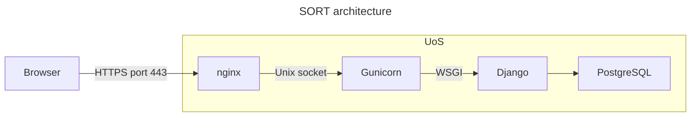

# Deployment

The production web server has the following architecture:




This app can be deployed to a web server using the script [`deploy.sh`](../deploy.sh).

You may also refer to the following guides:

* Django documentation: [How to deploy Django](https://docs.djangoproject.com/en/5.1/howto/deployment/)
* [Deploying Gunicorn](https://docs.gunicorn.org/en/latest/deploy.html)

The relevant files are:

* The `config/` directory contains server configuration files.

# Monitoring

## View service status

```bash
sudo systemctl status gunicorn
sudo systemctl status nginx
```

# Control

The services are controlled using [`systemd`](https://systemd.io/), which is the service management system on Ubuntu 24. To launch services:

```bash
sudo systemctl start gunicorn
sudo systemctl start nginx
```

To stop services:

```bash
sudo systemctl stop gunicorn
sudo systemctl stop nginx
```

